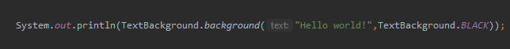
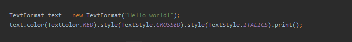
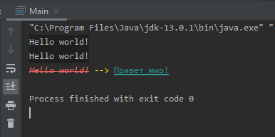

# Библиотека TextFormat | [Скачать](https://github.com/vankad24/Lib_TextFormat/raw/master/LibTextFormat.jar)
  * Эта библиотека поможет помочь изменить стандартный серый текст в консоли!
  * Вы можете воспользоваться static методами 
  
   
  * Или же отдельным классом 
  
   
  
  
  
  [Пример:](https://github.com/vankad24/Lib_TextFormat/blob/master/src/Main.java) в результате выполнения кода
  ```java
        System.out.println(TextBackground.background("Hello world!",TextBackground.BLACK)); 

        TextFormat text = new TextFormat("Hello world!");
        text.color(TextColor.RED).style(TextStyle.CROSSED).style(TextStyle.ITALICS).print();

        System.out.print(TextColor.color(" --> ",TextColor.YELLOW));

        text.setText("Привет мир!").style(TextStyle.BOLD_UNDERLINED).color(TextColor.TEAL).println();
  ```
  Мы получим следующий результат:
  
   
  
  # [Скачать](https://github.com/vankad24/Lib_TextFormat/raw/master/LibTextFormat.jar)
